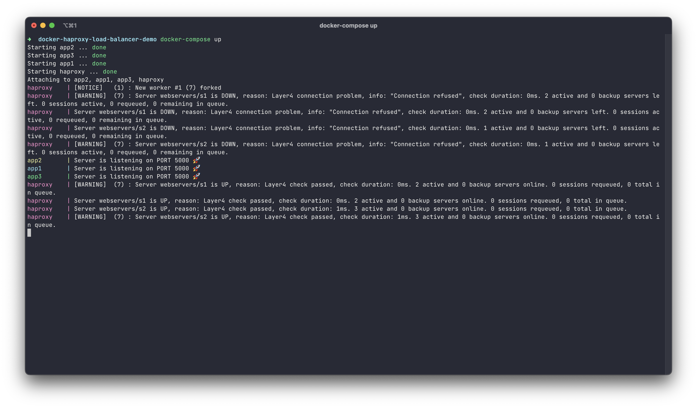
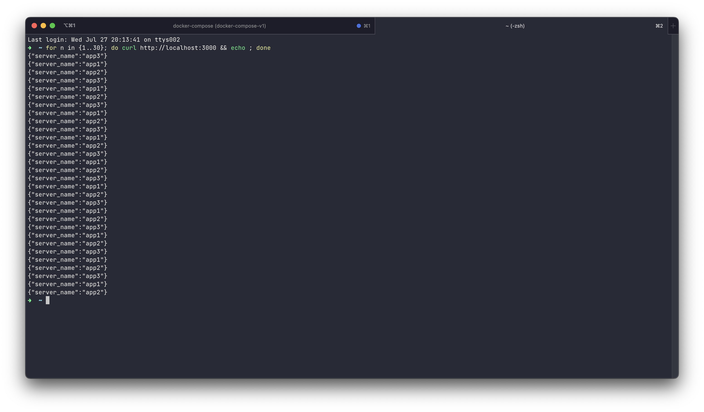
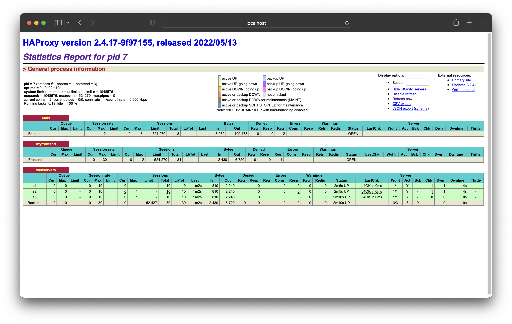

# HAProxy Load Balancing in Docker

Trying out HAProxy as a Load Balancer for distributing requests across multiple instances of dockerized ExpressJS application servers.

## Configuration

- Find the application code in the `app` directory. It is a simple ExpressJS server that echos out an enviornment variable
- Check out the `haproxy/haproxy.cfg` file for configuration parameters of HAProxy. Read for more details [here](https://www.haproxy.com/blog/haproxy-configuration-basics-load-balance-your-servers/)
  - Frontend for stats are hosted on the port `8404`
  - The frontend for serving requests are binded in the port `3000`. That is, port `3000` will accept all the requests and HAProxy will internally distribute them
  - Several instances of the application are registered under backend with their respective ports
- Check out the `docker-compose.yaml` file. It contains configuration to set up multiple instances of the application, as well as HAProxy.
- The number of application instances can be increased with the necessary changes in the Docker COmpose file as well as the HAProxy configuration file

## Try it out

- Clone this project

- Start the stack up! Run:

```sh
docker-compose up
```



> The `haproxy` contrainer might crash for the first time when starting up, as the dependent application instances are not up and running yet. However, it will restart and start working when all the dependents are healthy

- Send some requests! In a seperate terminal window, run:

```sh
for n in {1..50}; do curl http://localhost:3000 && echo ; done
```

- We see the responses coming from different application instances



- Check the stats on [http://localhost:8404](http://localhost:8404)


